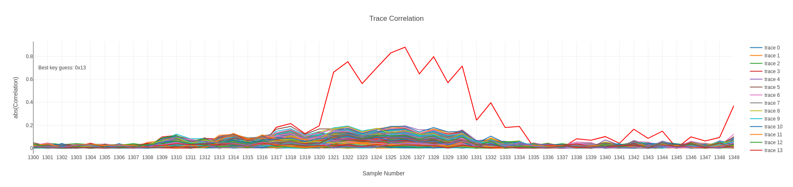

# Assignment 1: Plaintext Side CPA

**Description:** A trace file is given containing power traces collected during the execution of AES-128 encryption on an STM32F3 microcontroller interfaced with the ChipWhisperer-Lite. Each row in the provided CSV file consists of the plaintext input, the corresponding ciphertext output, and 5000 sampled power measurements. The dataset includes a total of 5000 such traces.<br>
***Task is to implement a Correlation Power Analysis (CPA) attack from the plaintext side to recover the first byte of the AES-128 key.*** In the standard CPA approach, the attack exploits the correlation between the measured power consumption and the Hamming weight or Hamming distance of the output of the inverse S-box operation on the XOR result of a ciphertext byte and a key guess. Consider hamming weight as power model.

### Compilation & Run
```bash
cargo build --release
./target/release/plaintext-side-cpa <path-to-trace-file>
```
`<path-to-trace-file>` defaults to `src/trace_data_bootcamp_PT5000.csv` if not provided.

### Pre-compiled Binaries
(Not uploaded on GitHub)<br>
Pre-compiled binaries for Linux and Windows are available in the `binaries` directory. If they don't work, please compile the code using the above instructions.

### Results
For the file `trace_data_bootcamp_PT5000.csv`, the first byte of the key is `0x13`, i.e. trave 19.

### Notes
In each trace only the measurements in the range of `window` *(line 178)* are considered for the attack. The values were hardcoded after observing the power traces.

<!-- center the image -->
<p align="center">
  
</p>

***
#### 2025 | Prasanna Paithankar